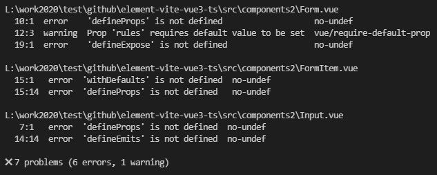
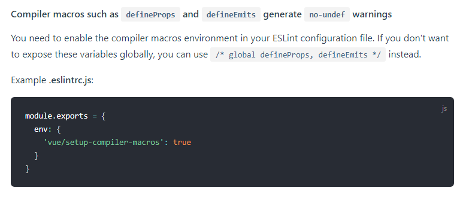
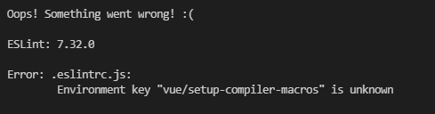

# element-vite-vue3-ts
组件开发实战

- 如何设计组件通讯策略
- 组件内容分发机制
- 使用composition api 合理构建组件逻辑
- 利用TypeScript编写高可维护性代码

defineProps 编译器的宏任务，不需要导入


async-validator 校验库

```
npm i async-validator -S
```


```javascript
npm i mitt -S
```

事件的监听和派发，典型的观察者模式

provide inject 单向数据流


今晚在使用Vue3开发的时候报了以下错误：
 
百度了一下发现有人说在eslint的规则里加

```javascript
 rules: {
    "no-undef": "off"
  },
```
但这个规则把所有未定义的变量的错误都屏蔽了，不是最优的解决方案，最后查了官网，发现官网建议这样：
 
但加**"vue/setup-compiler-macros": true** 之后又报了另外一个错误：

 


最终发现是eslint和eslint-plugin-vue的版本问题
最后我把版本更新为

```javascript
yarn add eslint@7.32.0
yarn add eslint-plugin-vue@8.0.0
```
就完美解决了


